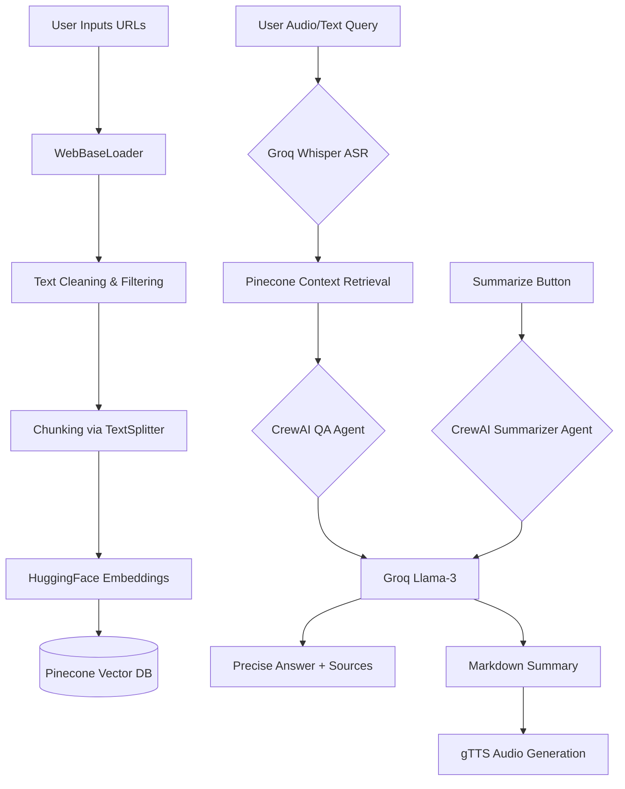

<div align="center">

# 📉 News Research Agent

**An AI-Powered Multimodal News Analysis, Finetuning, & Question Answering System**

[](https://streamlit.io/)
[](https://crewai.com/)
[](https://groq.com/)
[](https://www.pinecone.io/)
[](https://www.docker.com/)

</div>

---

## 📖 Overview

**News Research Agent** is a state-of-the-art, AI-driven research tool designed to analyze, extract insights, and summarize multiple news articles in real time. 

Built on a robust **Multi-Agent Architecture (CrewAI)**, this application leverages **Groq's high-speed Llama-3**, **HuggingFace embeddings**, and **Pinecone** to act as your personal AI researcher. 

Recently upgraded to a fully **Multimodal** experience, you can now interact with the agents using your voice via **Groq Whisper (ASR)** and listen to generated summaries via **Google Text-to-Speech (TTS)**. The entire application is fully containerized with **Docker** for instant deployment.

---

## ✨ Key Features

* 🌐 **Multi-URL Processing**: Analyze up to 3 complex news articles simultaneously.
* 🤖 **Multi-Agent Orchestration (CrewAI)**: Replaced legacy LangChain chains with specialized autonomous agents (Summarizer Agent & Principal News Researcher Agent) for higher accuracy and complex reasoning.
* 🎙️ **Multimodal Voice Input (ASR)**: Native Streamlit microphone integration securely streams your voice to Groq's lightning-fast `whisper-large-v3` model for instant transcription.
* 🔊 **Text-to-Speech (TTS) Outputs**: Generates cached MP3 audio files using `gTTS` so you can listen to your article summaries on the go.
* 🧠 **LoRA Finetuning Ready**: Includes a polished Jupyter Notebook for parameter-efficient finetuning (PEFT/QLoRA) of LLMs on news summarization datasets using `trl` and `bitsandbytes`.
* ⚡ **Lightning-Fast AI**: Employs Groq's `llama-3.3-70b-versatile` for instantaneous natural language processing.
* ☁️ **Cloud Vector Storage**: Uses Pinecone for robust indexing, fast similarity search, and instantaneous retrieval with 24-hour automatic background session cleanup.
* 🐳 **Dockerized Production Build**: Fully packaged into a lightweight, deployable Docker container avoiding environment drift and complex dependency setup.

---

## 🏗️ System Architecture



---

## 🛠️ Technology Stack

* **Frontend UI**: [Streamlit](https://streamlit.io/)
* **Multi-Agent Framework**: [CrewAI](https://crewai.com/)
* **Large Language Model (LLM)**: [Groq API](https://groq.com/) (Llama-3.3-70b-versatile)
* **Speech-to-Text (ASR)**: Groq Whisper (`whisper-large-v3`)
* **Text-to-Speech (TTS)**: `gTTS`
* **Embeddings Model**: HuggingFace (`sentence-transformers/all-MiniLM-L6-v2`)
* **Vector Database**: Pinecone
* **Finetuning**: `peft`, `trl`, `datasets`, `bitsandbytes` (QLoRA)
* **Deployment**: Docker

---

## 🚀 Getting Started

### Prerequisites

You need API keys for the following services:
- **Groq API Key**: Get it from [Groq Console](https://console.groq.com/keys)
- **HuggingFace Hub Token**: Get it from [HuggingFace](https://huggingface.co/settings/tokens)
- **Pinecone API Key & Index Name**: Get it from [Pinecone Console](https://app.pinecone.io/)

Create a `.env` file in the root directory:
```env
GROQ_API_KEY="your_groq_api_key_here"
HUGGINGFACEHUB_API_TOKEN="your_hf_token_here"
PINECONE_API_KEY="your_pinecone_api_key_here"
PINECONE_INDEX_NAME="your_pinecone_index_name_here"
```

### Option 1: Run via Docker (Recommended)

The easiest way to run the application in a clean environment:

```bash
# Build the Docker image
docker build -t news-agent:latest .

# Run the container (passes your .env file securely)
docker run -p 8501:8501 --env-file .env news-agent:latest
```
Access the app at **http://localhost:8501**

### Option 2: Run Locally (Python 3.13)

```bash
git clone https://github.com/your-username/News-Research-Agent.git
cd News-Research-Agent
pip install -r requirements.txt
streamlit run app.py
```

---

## 💡 How to Use

1. **Load Articles**: Paste up to 3 news article URLs into the sidebar.
2. **Process Data**: Click **"Process URLs"** to embed and store chunks in Pinecone.
3. **Summarize & Listen**: Click **"Summarize Articles"**. Once the text generates, click **"🔊 Listen"** to hear the AI read the summary to you.
4. **Multimodal Q&A**: Tap the **Microphone** icon at the bottom of the screen to speak your question aloud, or type it out. The CrewAI QA Agent will retrieve the facts and answer instantly!

---

<div align="center">
  <i>"Turning information overload into actionable intelligence."</i>
</div>
