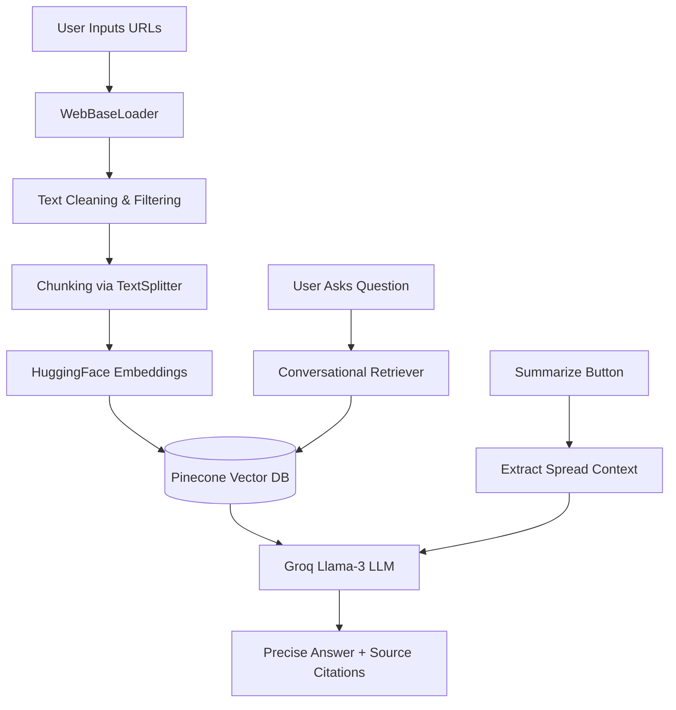

<div align="center">

# 📉 News Research Agent

**An AI-Powered Multi-Source News Analysis & Question Answering System**

[](https://streamlit.io/)
[](https://python.langchain.com/)
[](https://groq.com/)
[](https://www.pinecone.io/)
[](https://huggingface.co/)

</div>

---

## 📖 Overview

**News Research Agent** is a state-of-art, AI-driven research tool designed to analyze, extract insights, and summarize multiple news articles in real time. 

Built on top of **LangChain, Groq's high-speed Llama-3, HuggingFace embeddings, and Pinecone**, the system acts as your personal AI researcher. You can ask intelligent questions across multiple sources, request comprehensive summaries, and receive context-aware answers grounded strictly in the provided articles—virtually eliminating hallucinations.

The ultimate goal? To reduce information overload and transform raw news into **actionable insights**.

---

## ✨ Key Features

* 🌐 **Multi-URL Processing**: Analyze up to 3 complex news articles simultaneously.
* 🧹 **Smart Content Filtering**: Intelligently identifies and removes boilerplate junk (ads, cookie popups, menus) so the AI only reads what matters.
* 🤖 **Lightning-Fast AI Q&A**: Employs Groq's blazing-fast inference for `Llama-3.3-70b-versatile` to answer your natural language queries instantly.
* 📝 **One-Click Summarization**: Automatically synthesizes and summarizes key points from all processed articles.
* ☁️ **Cloud Vector Storage**: Uses Pinecone for robust indexing, fast similarity search, and instantaneous retrieval.
* 🔗 **Source Attribution**: Always shows its work! Provides direct references and expands source text for full transparency.
* 🕒 **Auto-Cleanup Daemon**: A background thread automatically manages database hygiene by deleting sessions older than 24 hours.

---

## 🏗️ System Architecture



---

## 🛠️ Technology Stack

* **Frontend UI**: [Streamlit](https://streamlit.io/)
* **Large Language Model (LLM)**: [Groq API](https://groq.com/) (Llama-3.3-70b-versatile)
* **Framework**: [LangChain](https://python.langchain.com/)
* **Embeddings Model**: HuggingFace (`sentence-transformers/all-MiniLM-L6-v2`)
* **Vector Database**: Pinecone
* **Web Scraping**: LangChain `WebBaseLoader` (BeautifulSoup4)
* **Memory**: `ConversationBufferMemory`

---

## 🚀 Getting Started

### Prerequisites

You need Python 3.9+ and API keys for the following services:
- **Groq API Key**: Get it from [Groq Console](https://console.groq.com/keys)
- **HuggingFace Hub Token**: Get it from [HuggingFace](https://huggingface.co/settings/tokens)
- **Pinecone API Key & Index Name**: Get it from [Pinecone Console](https://app.pinecone.io/)

### Installation & Setup

1. **Clone the Repository**
   ```bash
   git clone https://github.com/your-username/News-Research-Agent.git
   cd News-Research-Agent
   ```

2. **Install Dependencies**
   ```bash
   pip install -r requirements.txt
   ```

3. **Configure Environment Variables**
   Create a `.env` file in the root directory (or use Streamlit secrets) and populate it with your keys:
   ```env
   GROQ_API_KEY="your_groq_api_key_here"
   HUGGINGFACEHUB_API_TOKEN="your_hf_token_here"
   PINECONE_API_KEY="your_pinecone_api_key_here"
   PINECONE_INDEX_NAME="your_pinecone_index_name_here"
   ```

4. **Launch the Application**
   ```bash
   streamlit run app.py
   ```

---

## 💡 How to Use

1. **Load Articles**: Paste up to 3 news article URLs into the sidebar input fields.
2. **Process Data**: Click **"Process URLs"**. The agent will fetch the text, filter out junk, generate vector embeddings, and store them in Pinecone under a secure, isolated session ID.
3. **Summarize**: Click **"Summarize Articles"** to get an instant, overarching summary combining knowledge from all provided URLs.
4. **Ask Questions**: Type your specific query into the chat bar (e.g., *"What economic policies were discussed?"*). 
5. **Review Answers**: The agent will respond based *only* on the provided context, and you can click "View Sources" to verify exactly which text chunks it used.

---

## 🧠 Engineering Highlights

### Advanced Retrieval-Augmented Generation (RAG)
* Implements a strict prompt template to bind the LLM entirely to the retrieved context, effectively mitigating hallucinations.
* Uses Conversational Retrieval Chains with memory to understand follow-up questions.

### Intelligent Data Cleaning Pipeline
* Scraping modern web pages introduces immense noise (cookie banners, menus). A custom junk filtering function uses heuristic keyword mapping and alphabetical ratio checks to ensure only high-quality article text is embedded.

### Scalable & Clean Session Management
* Each user gets a unique namespace inside Pinecone isolated via `uuid`.
* An asynchronous background Python daemon routinely sweeps the vector database to purge session data older than 24 hours, ensuring 0 maintenance cost and unlimited scalability.

---

<div align="center">
  <i>"Turning information overload into actionable intelligence."</i>
</div>
